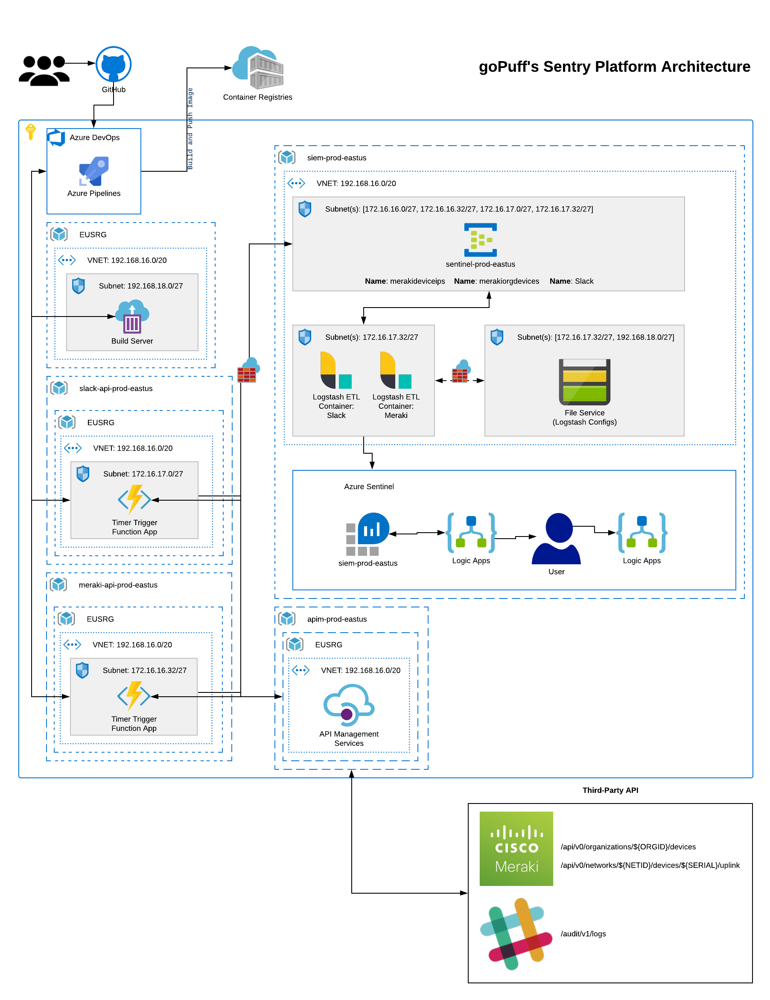

# goPuffs Sentry Platform

Serverless incident response platform to detect and alert on network and communication infrastructure

## Inspiration

As a startup, it is difficult to hire (_afford_) experienced security engineers and analysts. As the goPuff Security Team architect our Cloud and Facility Infrastructure, this model allowed our company to be nimble and flexible. This shared responsibility model allowed goPuff to focus on growing the business and focus on customer happiness.

By making these architecture decisions early, allowed leadership to mature our engineering team and focus on more of a zero trust model. Due to COVID-19, our company was forced to mature a lot faster than originally scoped. So how does a startup who's primary business model is delivery mature a security team with minimum staff and facing a pandemic?

## What it does

goPuff's Sentry Platform is designed to consume, transform, and alert on serverless infrastructure by using serverless services. goPuff's Sentry Platform is designed to alert on third-party cloud infrastructure that will help detect remote work force abuse, facility network abuse, and proactively identify systems that are misconfigured and remediate.

The current iteration of the goPuff's Sentry Platform is to design use cases to protect two main Cloud Infrastructure components:

- Slack Enterprise
- Cisco Meraki Networks

### Slack Enterprise

Paying for a Data Loss Protection (DLP) solution is an option, but that takes time and can be expensive. As the startup grew, process and technical debt was inevitable. To help with that, we have focussed on some use cases to tackle those areas

- **Use Case**: High Number of Downloads of sensitive files within the last two weeks
  - _Description_: An account could be blocked if the user is downloading a high volume of sensitive files. This file has a handful of business level information that should not be continuously downloaded
- **Use Case**: Slack Filename Keyword Sniffer
  - _Description_: An account could be blocked if the user triggers a high volume of keyword triggers
- **Use Case**: Maximum Daily Download
  - _Description_: An account could be blocked if there are doing heavy downloads. This could be a rapid data dump through Slack

### Cisco Meraki Networks

As a startup, having a Managed Service Provider (MSP) can be rewarding and challenging. This use case helps us identify when our ISP's SD-WAN LTE backup activates to alert our incident response team to update the facility network configuration

- **Use Case**: Identify Public IP Change
  - _Description_: Trigger an alert to incident response team to verify SD-WAN LTE backup is active and force business approved devices to only function on network to save on bandwidth utilization

## How we built it

The goPuff Security Team focussed on building this platform with serverless components with no virtual machines to allow our platform to be refactored in the future.

### Data Connector(s)

The goPuff Security Team designed the Sentinel Log Ingestion Format to utilize the REST API. This allowed our stack to utilize serverless services for collection and offload the Extract, Transform, Load (ETL) layer to a container (_utilizing Logstash_)

- **Slack Enterprise Collector**:

  - _Collector Service_: `Timer Trigger for Azure Functions` to monitor the Slack Audit Logs API: [Slack Enterprise Audit Logs](https://api.slack.com/enterprise/audit-logs)
    - _Description_: Timer Trigger fires every minute collecting specific Slack Audit actions and posts to an `Azure Event Hub`
  - _Azure Monitor Data Collector API (ETL Layer)_: Build and deploy a container on `Azure Container Instance (ACI)` service with [Logstash](https://www.elastic.co/logstash). [Logstash](https://www.elastic.co/guide/en/logstash/current/plugins-inputs-azure_event_hubs.html) connects to `Azure Event Hub` (_Extract_), filters the data that is needed (_Transforms_), and utilizes the Azure Monitor Data Collector API (_Load_) to send to [Azure Sentinels Log Analytics](https://github.com/yokawasa/logstash-output-azure_loganalytics) Workspace

- **Cisco Meraki Collector**:
  - _Collector Service_: `Timer Trigger for Azure Functions`:
    - _Description_: Timer Trigger fires every 30 minutes collecting the following API device endpoints and posts to an `Azure Event Hub`
      - [List the devices in an organization](https://dashboard.meraki.com/api_docs/v0#list-the-devices-in-an-organization)
      - [Return the uplink information for a device](https://dashboard.meraki.com/api_docs/v0#return-the-uplink-information-for-a-device)
  - _Azure Monitor Data Collector API (ETL Layer)_: Build and deploy a container on `Azure Container Instance (ACI)` service with [Logstash](https://www.elastic.co/logstash). [Logstash](https://www.elastic.co/guide/en/logstash/current/plugins-inputs-azure_event_hubs.html) connects to `Azure Event Hub` (_Extract_), filters the data that is needed (_Transforms_), and utilizes the Azure Monitor Data Collector API (_Load_) to send to [Azure Sentinels Log Analytics](https://github.com/yokawasa/logstash-output-azure_loganalytics) Workspace

### Deployment Strategy

The goPuff Security Team utilized the following CI/CD deployment flow using Azure DevOps

- Stages:
  - **Stage**: `Build Container`
    - _Job_: Build and Push container to Azure Container Registry (ACR)
  - **Stage**: `Delete Container Group`
    - _Job_: run an `inlineScript` to delete resource group container group
  - **Stage**: `Deploy Container Azure Resource Manager (ARM) Template`
    - _Job_: Deploy Logstash container with `Azure Storage Account Volume Mount` via ARM Template inside a Azure Subnet
      - _This allowed us to securely deploy a Logstash config by Enabling a TLS endpoint in a sidecar container_
  - **Stage**: `Build Function App Service`
    - _Job_: Build, Archive, Copy, and Publish Timer Trigger Azure Function to Azure Subnet
  - **Stage**: `Deploy Azure Function App Service to Azure Subnet`
    - _Job_: Download, Deploy, Stage Azure Function artifact into Azure Subnet

### Playbooks

The playbooks provide the end user with both notification and actions strategies that leverage the Slack APIs. When a playbook alert is triggered, a Slack channel monitored by goPuff Incident Response can action on the alert within Slack. This allows us to abstract staff from working in Azure for simple incidents. This has improved workflow automation and faster mitigation of events

**Note**: _any secret values or identifiers have been removed for security purposes, but the contextual strategy is transparent_

## Challenges we ran into

- **Costs**
  - When first designing this model, the goPuff Security Team had to be resourceful on the amount of logs that were going to be ingested due to tight budgets due to COVID-19. This was a bit difficult at first for the team as they were learning the mechanics of Azure Sentinel and had limited experience with the ETL process
- **Skillset**
  - The goPuff security team is lean, so when working on use cases most of the staff were newer to Security Information and Event Management (SIEM) technology. There was a week learning curve on what to action on for most of the platforms. As we start to bring in more Incident Responders, we expect the same learning curve when trying to create newer use cases in the future
- **ARM Development**
  - When creating the ARM to deploy containers, there is very minimum verbose debug logging available during deployment. The goPuff Security team got stuck on the `Azure Storage Account File Share Service connection`. Whenever a misconfigured ARM was deployed, there was a 30 minute delay for the File Share Service to fail. This caused multiple hours of troubleshooting before we identified the misconfigured string.

## Accomplishments that we're proud of

- **Infrastructure-as-Code (IaC)**
  - How we designed and able to deploy the full infrastructure in less than 10 minutes for any new code or container deployment. This allows us to identify new use cases and have a working environment quickly
- **Team Building**
  - This project allowed our goPuff Security Team to build multiple skill sets across goPuff verticals. This empowered engineers to think about security risk in a different way to not only protect Infrastructure, but understand business risk to platforms

## What we learned

Azure Sentinel can be utilized in multiple ways outside of normal security functions. The goPuff Security Team was able to identify a new method to detect business risks. This new method can help automate simple tasks allowing our Incident Response team to focus on more pressing tasks. By triggering the playbook functionality, this freed up staff and provided goPuff with a method to proactively remediate process with Azure Logic Apps.

## What's next for goPuff's Sentry Platform

- **Azure Kubernetes Service (AKS)**
  - The goPuff Security Team has identified some ACI limitations in our stack which is going to force us to move to AKS for most of our platform. This will also let us build manifests to focus on moving functionality to other clouds, but still utilize the raw power of Azure Sentinel as a SIEM
- **Durable Function Development**
  - The goPuff Security team loves Logstash, but there is some limitations with the Output plugin. To figure out how to work around this, we might invest development time to rewrite a new method to write with the `Azure Monitor Data Collector API`.
- **Syslog Ingest Layer**
  - Once we stand up our AKS layer, the goPuff Security Team will be deploying a Syslog ingest layer to allow our network equipment to push data instead of pulling via the API. This will allow us to consume our MSP's router and firewall logs into our environment to help with proactive remediation

## Video Tutorial

[Azure Sentinel Hackathon Submission Video](https://youtu.be/tMBDwF1aF6s)

## Architecture

Source: [Lucidchart](https://app.lucidchart.com/invitations/accept/da0e21c0-d0d5-4704-b221-be0b18c3c207)

